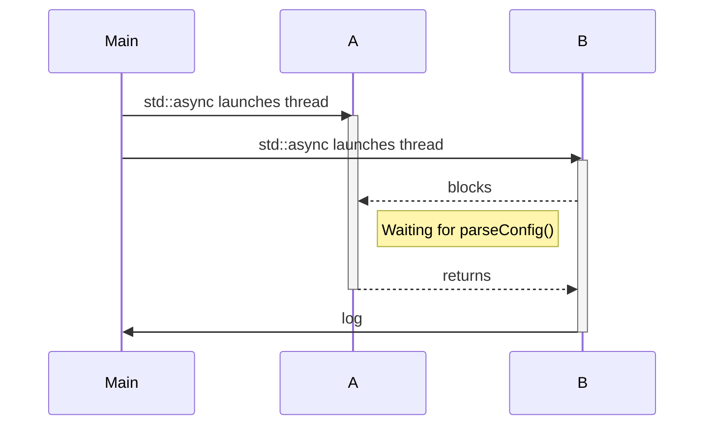
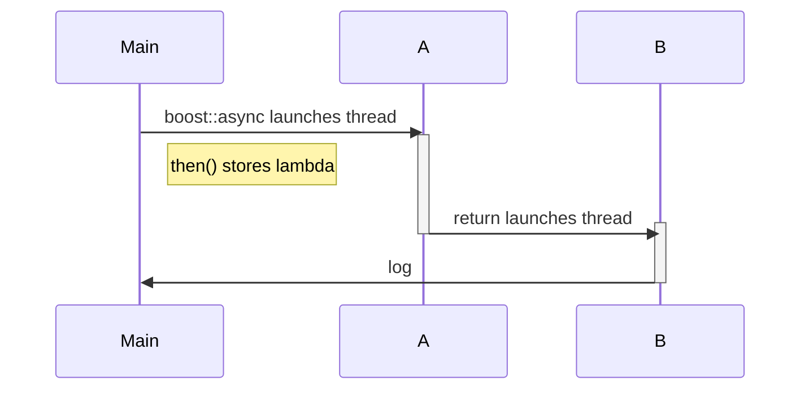

# Interior Decorating With Futures
```ascii
  ___                                                  ___  
 /   \                                                /   \ 
/     \        _______                               /     \
^^^^^^^       /  ____/                               ^^^^^^^
   " *       /  /___         _____                      " * 
   " *      /  ____/  __  _ /_  _/ __  _  ___  ____     " * 
 __"__     /  /      / / //  / /  / / // / _/ / _ /   __"__ 
"__o__"   /  /      / /_//  / /  / /_// / /  / __/   "__o__"
"     "  /__/      /____/  / /  /____/ /_/  /___/    "     "
```

The room due for a remodel is a native rendering library which keeps the main thread focused on graphics API calls while other threads are responsible modelling various data sources as geometry, textures, etc.
Some users with a poor connection experience high latency and others who mix local and remote sources see nothing at all. From profiling, it is clear a specific thread blocks virtually all modelling.

```cpp
Data theProblem() {
  std::promise<Data> promise;
  std::future<Data> future = promise.get_future();

  someCallbackAPI([promise](Data data) { // A
    promise.set_value(data);
  });

  return future.get();                   // B
}
```

Line A creates an HTTP request for some arbitrary data which is returned asynchronously by a callback. The calling code is synchronous so line B intentionally blocks the modelling thread interrupting the flow of graphics primitives.
However the API is clearly async so it should be an easy fix right?

## Async outbreak

Asynchronous code has an all or nothing infectious quality. We *can* block but would prefer to store the series of dependent tasks and execute them lazily.
In javascript this is trivial but in C++ we have to get our hands dirty. A proper futures implementation spreads the async contagion.

## Promising future

I was disappointed to learn that `std::future` does not support continuations. Let's compare syntax and concurrency with `boost::future` which do support continuations.

### Continuations

```cpp
auto futureConfig = std::async([]() {
  return parseConfig("config.json"); // A
});

std::async([futureConfig]() {
  auto config = futureConfig.get();  // B
  log(log::info, config.version);
});

```

Line A is run in a new thread, as is line B. However, Line B blocks to wait for the result of `parseConfig()`.



With very similar syntax boost::future avoids blocking with lazy scheduling.

```cpp
auto futureConfig = boost::async([]() {
  return parseConfig("config.json"); // A
});

futureConfig.then([](auto future) {
  auto config = future.get();        // B
  log(log::info, config.version);
});
```



Calling `then()` stores our continuation lamda in the future's shared state. When the future is resolved, a new thread is created for B.
This syntax is a concise way to express a series of dependent asynchronous tasks and boost's implementation avoids unnecessary blocking.

### Executors
Another advantage for boost is *Executor* support. `std::async()` always creates a new thread which limits use.
Boost async and future continuations may be scheduled with an [executor](https://www.boost.org/doc/libs/1_86_0/doc/html/thread/synchronization.html#thread.synchronization.executors.ref.concept_executor).

```cpp
boost::thread_executor pool;
boost::async(pool, []() {
  // now I run on a thread in the pool
  return parseConfig("config.json");
});
```

> boost worked in my particular situation, [better futures](https://github.com/alandefreitas/futures) is a great option with even more features. Also, note that executors are experimental in boost 1.86.

## Write your own executor
Our native rendering library has a thread pool and we want our futures to execute there.
We adapt and decorate to benefit from futures without creating new threads.

Here's an example what that might look like. Note that you [do not have to inherit](https://www.boost.org/doc/libs/1_86_0/doc/html/thread/synchronization.html#thread.synchronization.executors) from `boost::executor`.

```cpp
class Executor : public boost::executor
{
public:
  void close() override;

  bool closed() override;

  void submit(boost::executor::work&& closure) override;

  bool try_executing_one() override;

private:
  std::shared_ptr<LegacyPool> legacyPool;
};
```

As an adapter, I implemented `close()` and `closed()` as access control to LegacyPool because I want the pool to live on.

Also, `try_executing_one()` is required but only called by `executor::reschedule_until()` or `executor::schedule_one_or_yield()`.
If you do not need it, it is sufficient to log a warning and return false.

Finally, `submit()` expects the closure to be executed (typically) in the future. This could be as simple as `legacyPool->schedule(closure)` but perhaps you need to wrap the closure in an interface expected by the pool.

Let's quickly demonstrate use before decorating.

```cpp
auto legacyPool = std::make_shared<LegacyPool>();
Executor executor{legacyPool};


boost::async(executor, []() {
  std::cout << "I run on the legacy pool" << std::endl;
});
```

### Decorating
Suppose LegacyPool supports priority with a call to `LegacyPool::schedule(closure, priority)`.
We can declare a DecoratedExecutor which serves a particular priority.

```cpp
class DecoratedExecutor
{
public:
  void close();

  bool closed();

  void submit(std::function<void(void)> closure) {
    legacyPool->schedule(closure, priority);
  }

  bool try_executing_one();

  void setPriority(Priority newPriority);

private:
  std::shared_ptr<LegacyPool> legacyPool;
  Priority priority
};
```

With a handful of priority levels this approach is quite readable. However, take care with `setPriority()` because lazy scheduling means a continuation is `submit()` when its antecedent resolves.

```cpp
auto legacyPool = std::make_shared<LegacyPool>();
DecoratedExecutor highPriority{legacyPool, Priority::High};
DecoratedExecutor executor{legacyPool, Priority::Medium};
DecoratedExecutor lowPriority{legacyPool, Priority::Low};


boost::async(highPriority, []() {
  std::cout << "I am important" << std::endl;
});

boost::async(executor, []() {
  std::cout << "I am in the middle" << std::endl;
}).then(executor, [](auto future) {
  std::cout << "I might be in the middle" << std::endl;
});
executor.setPriority(Priority::Low); // might execute before then()'s closure

boost::async(lowPriority, []() {
  std::cout << "I can wait" << std::endl;
});
```

The closure is a type-erased callable so it is not inherently helpful to store the priority with the closure -- we can only `closure()`.

### Fixing `theProblem()`
Finally we should start rewriting the original, problematic code.

```cpp
auto legacyPool = std::make_shared<LegacyPool>();
DecoratedExecutor highPriority{legacyPool, Priority::High};
DecoratedExecutor lowPriority{legacyPool, Priority::Low};

boost::future<Data> theProblemFixed() {
  boost::promise<Data> promise;
  boost::future<Data> = promise.get_future();

  someCallbackAPI([promise](Data data) {
    promise.set_value(data);
  });

  return future;
}

boost::shared_future<Parsed> parsed = 
  theProblemFixed().then(highPriority, [](auto future) {
    auto data = future.get();
    return parse(data);
  });

parsed.then(highPriority, [](auto future) {
  // do something valuable with parsed data
});

parsed.then(lowPriority, [](auto future) {
  // compute and log some metrics
});
```

In this example, the future spreading stops here. In my real use case `theProblem()` had a large callstack of dependent, synchronous operations not easily wrapped in a few `then()`.
Suddenly many types *wanted* to be `future<T>` but it was more practical to refactor and defer calling `theProblemFixed()` much higher up the stack.
